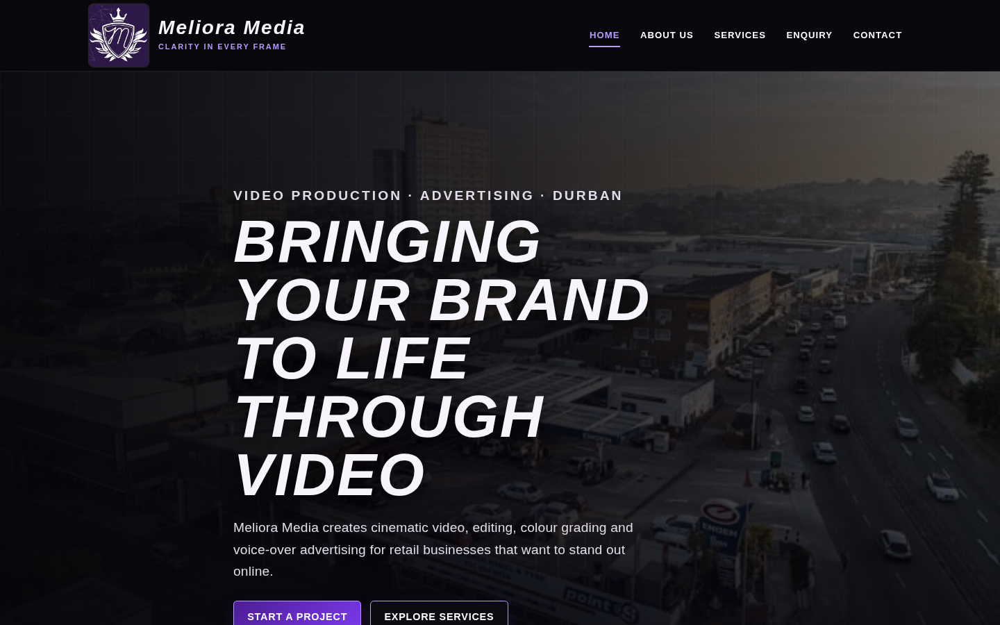
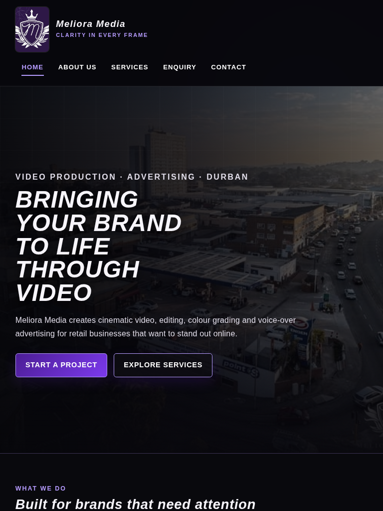
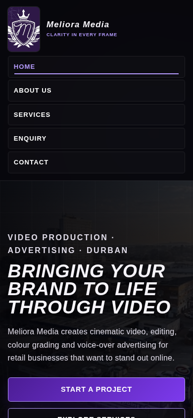

# WEDE5020 POE — Meliora Media Website

**Student:** Shahaan Khan  
**Student Number:** ST10511080  
**Module:** WEDE5020 — Web Development (Introduction)  
**Part:** Part 2 — Designing the Visuals: CSS Styling and Responsive Design

## Project overview

Meliora Media is a Malvern/Durban-based video production and advertising business. The website gives the business a central branded presence beyond social media and makes its services, credentials and contact/enquiry routes easy to understand.

### Goals and objectives

- Strengthen the legitimacy and consistency of the Meliora Media brand.
- Present services and recent work in a clear, visually engaging way.
- Make contact and project enquiries straightforward.
- Use semantic HTML and one shared external stylesheet to keep the site maintainable.
- Deliver a responsive experience that adapts from desktop to tablet and mobile.

## Website pages and functionality

| Page | Purpose / functionality |
|---|---|
| `index.html` | Homepage hero, short brand positioning, service preview and calls-to-action. |
| `about.html` | Company story, credentials and team/working approach. |
| `services.html` | Detailed service descriptions plus responsive recent-work image gallery. |
| `enquiry.html` | Structured project enquiry form with service and timeline fields. |
| `contact.html` | Location, email, WhatsApp, Instagram and link to the detailed enquiry form. |

## Expanded sitemap

```text
Home (index.html)
├── About Us
│   ├── Our Story
│   └── Credentials / Team approach
├── Services
│   ├── Professional Video Shoots
│   ├── Editing & Colour Grading
│   ├── Voice-Over Production
│   ├── Advertisement Creation
│   └── Recent Work Gallery
├── Enquiry
│   ├── Contact details
│   ├── Service selection
│   ├── Timeline selection
│   └── Project brief
└── Contact
    ├── Location
    ├── Email
    ├── WhatsApp
    └── Instagram
```

## Part 2 CSS implementation

### External stylesheet and cascade

All five HTML pages link to the same stylesheet: `src - website/css/style.css`. Shared brand rules are defined once and reused throughout the website. More specific component rules and breakpoint rules then build on those base styles so the cascade is used rather than duplicating inline styles.

### Base style / CSS reset

The stylesheet begins with a small reset (`box-sizing`, margin resets, responsive media defaults and inherited form typography), followed by reusable CSS custom properties for colour, typography, spacing and shadows.

### Colour palette

| Role | Colour |
|---|---|
| Primary background | `#09090D` |
| Surface | `#14131A` |
| Elevated surface | `#1D1926` |
| Brand purple | `#7C3AED` |
| Light purple accent | `#B69CFF` |
| Main text | `#F7F5FB` |
| Muted text | `#C9C5D2` |

The palette is based on the purple/white Meliora Media logo and uses light text against dark surfaces for clear contrast. WCAG guidance states that normal text should generally reach at least a 4.5:1 contrast ratio against its background.

### Typography

The proposal specified Magneto for display text and Angsana New for body text. The CSS keeps those names first in the font stacks while providing common fallbacks so the site remains readable when those fonts are not installed. Headings use stronger weight, italics and tighter line-height; body copy uses a larger line-height for readability.

### Layout structure

CSS Grid is used for two-column content areas, service cards, galleries and forms. Flexbox is used for the header, navigation, brand lock-up and button rows. MDN describes Grid as a two-dimensional layout system suitable for arranging content into rows and columns.

### Decorative and interactive styling

Cards use borders, shadows, gradients and purple accent bars. Links and controls include `:hover`, `:focus-visible` and `:active` states. Focus indicators remain visible for keyboard users.

## Responsive design

The website uses relative units (`rem`, `%`, `vw` and `clamp()`) and three main responsive ranges:

- **Desktop:** default layout above 62rem, with multi-column grids and horizontal navigation.
- **Tablet:** `@media (max-width: 62rem)` reduces dense card layouts and allows the navigation to wrap.
- **Mobile:** `@media (max-width: 42rem)` moves major content to one column and turns navigation into a two-column touch-friendly grid.
- **Small mobile:** `@media (max-width: 30rem)` stacks the navigation and buttons into single columns.

Media queries are a core responsive-design technique because they apply CSS conditionally to characteristics such as viewport size. The site also includes a `prefers-reduced-motion` media query for users who request reduced animation.

### Responsive images

The home hero uses `<picture>`, `srcset` and `sizes`. The Services gallery uses responsive `srcset` candidates at 480px, 800px and the original 1179px width so the browser can choose a suitable source for the current display size. MDN documents `srcset` and `sizes` specifically for this purpose.

## Part 1 feedback corrections

The lecturer awarded **77/100** for Part 1. The main improvement points were richer feature descriptions, an actual colour palette, stronger technical/budget references, a more detailed sitemap, tidier folders, navigation inside the header, stronger comments, a detailed README/changelog and more references. These points have been addressed in Part 2 and are recorded in detail in `docs/part1-feedback-corrections.md`.

The original feedback also noted that only one of the two proposals was submitted. Because the original Part 1 document names “Pop cultured” without a complete proposal, a clearly labelled corrective appendix has been added at `docs/alternative-proposal.md`.

## Budget clarification

The original proposal estimated approximately R10,000 for development and R1,000 for a major maintenance update. These remain project estimates rather than fixed market prices. For infrastructure, current xneelo pages list Basic Web Hosting at **R99/month** and `.co.za` registration/renewal at **R110/year** (pricing should always be rechecked before purchase). On that basis, first-year basic hosting plus a `.co.za` domain is approximately **R1,298** before any development or maintenance charge.

## Browser / responsive testing

The Part 2 website was checked at the following viewport sizes using Chromium developer-style viewport emulation:

| Test | Viewport | Evidence |
|---|---:|---|
| Desktop | 1440 × 900 | `docs/screenshots/home-desktop.png` |
| Tablet | 768 × 1024 | `docs/screenshots/home-tablet.png` |
| Mobile | 390 × 844 | `docs/screenshots/home-mobile.png` |

### Desktop


### Tablet


### Mobile


## Changelog

### 2026-10-05 — Part 2 CSS styling and responsive design

- Created `css/style.css` and linked it to **all five HTML pages**.
- Added a CSS reset and reusable custom properties for the site-wide design system.
- Implemented consistent colours, typography, borders, shadows, spacing and component styling.
- Built responsive layouts using CSS Grid and Flexbox.
- Added comprehensive `:hover`, `:focus-visible` and `:active` states for links, buttons and form controls.
- Added tablet, mobile and small-mobile media queries.
- Added `prefers-reduced-motion` support.
- Added responsive image variants and implemented `<picture>`, `srcset` and `sizes`.
- Moved primary navigation **inside each semantic `<header>`**, as requested in Part 1 feedback.
- Fixed malformed HTML from Part 1, including the incomplete About section and the unclosed social link in Contact.
- Replaced informal/vague code comments with comments that explain structural decisions.
- Expanded About, Services and Enquiry content to provide clearer page-specific functionality.
- Added `aria-current`, a skip link, useful `autocomplete` values and accessible focus styling.
- Removed duplicate root-level images, the empty research folder and placeholder `.gitkeep` files to tidy the structure.
- Added a detailed feedback-correction document and second-proposal corrective appendix.
- Added updated technical, accessibility, responsive-image and hosting references.
- Added responsive screenshot evidence for desktop, tablet and mobile.

## Suggested Git commit sequence

To satisfy the requirement for multiple descriptive commits, commit the work in logical stages rather than as one large commit. Suggested messages:

1. `fix: correct Part 1 HTML structure and move nav into header`
2. `feat: add shared external stylesheet and base visual system`
3. `feat: build responsive grid flexbox and breakpoint layouts`
4. `feat: add responsive images and interactive pseudo-class states`
5. `docs: expand README changelog feedback corrections and references`
6. `test: add desktop tablet and mobile screenshot evidence`

> The repository history cannot be created by a ZIP file alone; these commits need to be made and pushed through Git/GitHub by the student.

## Final file structure

```text
WEDE5020 POE project files - Shahaan Khan - ST10511080/
├── README.md
├── ST10511080 - WEDE5020 POE.pdf
├── github repo link.txt
├── docs/
│   ├── alternative-proposal.md
│   ├── part1-feedback-corrections.md
│   └── screenshots/
│       ├── home-desktop.png
│       ├── home-tablet.png
│       └── home-mobile.png
└── src - website/
    ├── index.html
    ├── about.html
    ├── services.html
    ├── enquiry.html
    ├── contact.html
    ├── css/
    │   └── style.css
    └── images/
        ├── logo.jpg
        ├── aerial-durban.jpg
        ├── ferrari-front.jpg
        ├── ferrari-badge.jpg
        ├── ferrari-headlight.jpg
        └── responsive/
            └── responsive image variants
```

## References

Badri, R., 2026. *Co-owner, Meliora Media*. Interviewed by Shahaan Khan [Discord voice message], 1 September 2026.

MDN Web Docs, 2026. *CSS grid layout*. Available at: <https://developer.mozilla.org/en-US/docs/Learn_web_development/Core/CSS_layout/Grids> [Accessed 5 October 2026].

MDN Web Docs, 2026. *CSS media queries*. Available at: <https://developer.mozilla.org/en-US/docs/Web/CSS/Guides/Media_queries> [Accessed 5 October 2026].

MDN Web Docs, 2026. *Using responsive images in HTML*. Available at: <https://developer.mozilla.org/en-US/docs/Web/HTML/Guides/Responsive_images> [Accessed 5 October 2026].

Meliora Media, 2026. *@official_meliora_media* [Instagram]. Available at: <https://www.instagram.com/official_meliora_media/> [Accessed 5 October 2026].

The Independent Institute of Education, 2026. *Web Design [WEDE5020 Module Manual]*. Internal VLE / SharePoint [Accessed 5 October 2026].

W3C Web Accessibility Initiative, 2026. *Understanding Success Criterion 1.4.3: Contrast (Minimum)*. Available at: <https://www.w3.org/WAI/WCAG22/Understanding/contrast-minimum> [Accessed 5 October 2026].

xneelo, 2026. *Domain Name Search and Registration*. Available at: <https://xneelo.co.za/domains/> [Accessed 5 October 2026].

xneelo, 2026. *Web Hosting*. Available at: <https://xneelo.co.za/web-hosting/> [Accessed 5 October 2026].
